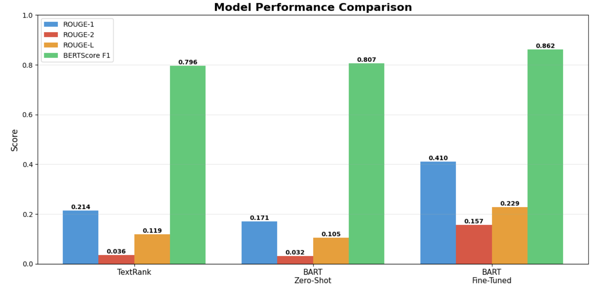
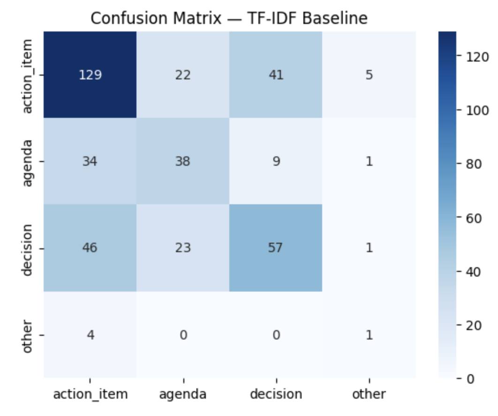

# Meeting Analytics System

> **Automated meeting summarization and action item extraction using NLP and transformer models**


**Key Results:** 91% improvement over baseline | 72% classification accuracy | BERTScore 0.862

## Overview

This NLP pipeline automatically processes meeting transcripts and generates:

✅ **Concise summaries** of meeting agendas and key decisions  
✅ **Extracted action items** with task descriptions and assignments  
✅ **Structured JSON output** categorizing content (Agenda, Decision, Action, Other)

**Problem:** Manual note-taking is time-consuming and misses important details.  
**Solution:** Automated system that transforms raw transcripts into actionable meeting minutes.

## Technical Approach

### 1. Data Processing
- Processed **247 meeting transcripts** from AMI and ICSI corpora (1,171 utterances)
- Text cleaning: removed filler words ("um", "uh"), normalized spacing, segmented sentences
- Chunked long transcripts into 1000-token segments for model processing

### 2. Meeting Summarization

Evaluated three approaches:

**TextRank (Extractive Baseline)**
- Graph-based sentence ranking using TF-IDF and PageRank
- ROUGE-1: 0.214

**BART Zero-Shot**
- Pre-trained facebook/bart-large-cnn without fine-tuning
- ROUGE-1: 0.171 (underperformed baseline)

**BART Fine-Tuned** ⭐
- Fine-tuned on 138 AMI samples (6 epochs, AdamW, lr=2e-5, batch size 4)
- **ROUGE-1: 0.410 (91% improvement)**
- **BERTScore F1: 0.862**

### 3. Action Item Classification

Multi-class classification using **spaCy NER + rule-based patterns**:

| Category | Precision | Recall | F1-Score |
|----------|-----------|--------|----------|
| Decisions | 82.9% | 77.3% | **0.800** |
| Agenda Items | 80.0% | 78.0% | **0.790** |
| Other | 90.0% | 58.1% | 0.706 |
| Action Items | 37.8% | 89.5% | 0.531 |

**Overall accuracy: 72%** on 166 manually annotated segments

### 4. Structured Output

Example JSON output:
```json
{
  "summary": "The team discussed Q1 roadmap and decided to prioritize feature X...",
  "action_items": [
    {
      "task": "create design mockups",
      "person": "John",
      "deadline": "by Friday"
    }
  ]
}
```

## Results

### Summarization Performance

<p align="center">
  
  <br>
  <i>Fine-tuned BART achieves 91% improvement over TextRank baseline across all ROUGE metrics</i>
</p>

| Model | ROUGE-1 | ROUGE-2 | BERTScore F1 |
|-------|---------|---------|--------------|
| TextRank | 0.214 | 0.036 | 0.796 |
| BART Zero-Shot | 0.171 | 0.032 | 0.807 |
| **BART Fine-Tuned** | **0.410 ⬆️91%** | **0.157** | **0.862** |


### Classification Performance

<p align="center">
  
  <br>
  <i>Classification accuracy: 72% across 166 annotated segments</i>
</p>

**Performance by Category:**
- ✅ **Decisions:** F1 = 0.800 (Best)
- ✅ **Agenda Items:** F1 = 0.790
- ✅ **Other:** F1 = 0.706
- ⚠️ **Action Items:** F1 = 0.531 (High recall 89%, Low precision 38%)
